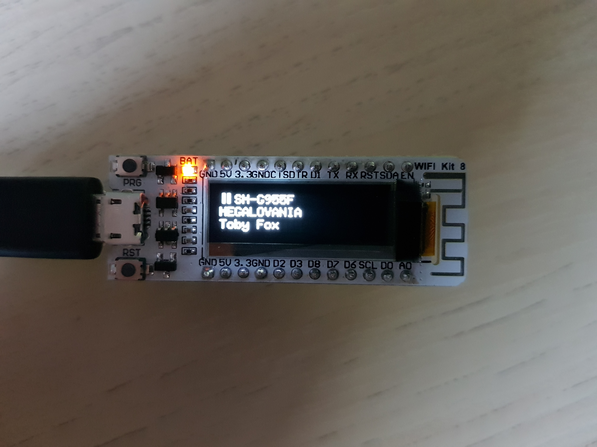

This repo contains the code for a Spotify remote demo application for an ESP8266-based microcontroller.

# ESP8266 with 128x32 OLED display
The ESP8266 is a low-cost WiFi-enabled microcontroller. It's like an Arduino, but even cheaper than the clones and with full access to the internet.
The chip was developed by Chinese manufacturer Espressif. It gained popularity in the West due to its cheap price and low number required additional components (some variants even come with 1MB of flash built-in).
This one comes with a monochrome display and 4MB of onboard SPI flash, as well as a connector for a single cell lithium ion battery. (When no battery is connected an orange LED will rapidly blink unfortunately, the only way to stop this is to physically remove it!)

# Demo - Spotify Remote
To demonstrate the capabilities of this little MCU, I developed a Spotify remote application.

There are a number of popular firmwares / SDK's available for the ESP8266, including [Arduino](https://arduino-esp8266.readthedocs.io/en/latest/) and [MicroPython](https://docs.micropython.org/en/latest/esp8266/tutorial/intro.html).
For simplicity, the [NodeMCU Lua-based firmware](https://nodemcu.readthedocs.io/en/master/) was chosen for this project. It provides a large number of optional modules to interact with hardware (e.g. OLED displays, addressable RGB LED strips) and software (e.g. HTTP, WebSockets, TLS).

## Code
All of the Lua code running on the board for this project can be found in the `lua/` subdiretory of this repo:

File | Description
-- | --
[`_init.lua`](lua/init.lua) | Initial code executed from LFS by firmware
[`dummy_strings.lua`](lua/dummy_strings.lua) | Dummy file, forces some strings to be loaded from LFS to save RAM
[`config.lua.example`](lua/config.lua.example) | Template for WiFi and Spotify backend config
[`streaming_rest.lua`](lua/streaming_rest.lua) | Hacky streaming HTTPS JSON REST client (to save RAM)
[`main.lua`](lua/main.lua) | Loads config, sets up display and connects to WiFi
[`spotify.lua`](lua/spotify.lua) | Main Spotify remote application

## Setup
While the code is pre-flashed onto the microcontroller, it needs WiFi credentials and a Spotify token to work. These are stored in a `config.lua` file which should be uploaded to the board:
1. Install [NodeMCU-Tool](https://github.com/AndiDittrich/NodeMCU-Tool). This can be used to interact with the NodeMCU firmware over the USB to UART adapter on the board. It's an NPM package so a `sudo npm install -g nodemcu-tool` should do the trick.
2. Copy `config.lua.example` to `config.lua` and add your credentials to the template
    1. Replace the value of `config.wifi.ssid` with the name of your WiFi network and replace the value of `config.wifi.pwd` with your WiFi password
    2. Go to https://espremote.cf and obtain a token. This is a simple service created for this project that fulfills the backend role in the Spotify API [Authorization Code Flow](https://developer.spotify.com/documentation/general/guides/authorization-guide/#authorization-code-flow). You can find the code running at https://espremote.cf under `spotify-backend/`.
	In exchange for logging in to your Spotify account, you will get a unique token which you can paste into `config.lua` in place of the sample value for `config.remote_token`. The microcontroller will use this to obtain short-lived tokens which permit access to the Spotify API.
3. Upload the edited `config.lua` to the board with `nodemcu-tool`:
    1. Connect the board to your computer via USB - note that you might need drivers for the USB to serial adapter on macOS (available [here](https://www.silabs.com/products/development-tools/software/usb-to-uart-bridge-vcp-drivers))
    2. Run `nodemcu-tool upload config.lua` - this should upload the file to the board
4. Hit the reset button on the ESP8266 (bottom left, labelled `RST`) or replug it into your computer / another power source
5. After connecting to your WiFi network, the text "Loading data from Spotify API" should scroll across the screen for a few seconds before changing to either "No active sessions" (if no devices are currently using your Spotify account) or with a details screen similar to the photo above.

You can now use this to see what's playing on your Spotify account, and press the button on the top left to play / pause your music! (Note that there will be a delay of a few seconds between pushing the button and the music playing / pausing).

# Notes and technical details
## On limited memory
Due to its low cost, the ESP8266 has _very_ little RAM. (Around ~48KB after the NodeMCU firmware has started before any user code is loaded).
By default, code is uploaded to the chip to the SPIFFS read/write filesystem (via `nodemcu-tool upload`) and read into memory for execution. This further reduces the amount of available memory for use by the application. Uploading the code in this way for the Spotify demo results in the ESP8266 running out of memory just by initiating a TLS handshake!

To get around this problem, the NodeMCU developers came up with LFS, or "[Lua Flash Store](https://nodemcu.readthedocs.io/en/master/en/lfs/)". Here, the Lua code is compiled and optimized on a host computer before being flashed to an area of flash which is separate to the SPIFFS filesystem. Since the flash is mapped into memory, it can execute directly from there without any need to load anything into memory (other than any variables of course).
Note that this is much This saves a lot of RAM and allows a HTTPS request to work without the board running out memory. However, many of the JSON responses from the Spotify API, such as `/v1/me/player` - which returns a lot of information about the user's current playing track, are quite large. The built-in HTTP module does not stream the response, so the chip's memory will quickly fill up. To solve this, a simple HTTPS client was written (`streaming_rest.lua`) which makes a request over a TLS socket to the host and streams the response into `sjson`, the built-in module which allows for JSON data to be decoded in chunks.
more difficult to set up than using `nodemcu-tool` to upload to the filesystem - this write-up will not go into these details.

This saves a lot of RAM and allows a HTTPS request to work without the board running out memory. However, many of the JSON responses from the Spotify API, such as `/v1/me/player` - which returns a lot of information about the user's current playing track, are quite large. The built-in HTTP module does not stream the response, so the chip's memory will quickly fill up. To solve this, a simple HTTPS client was written (`streaming_rest.lua`) which makes a request over a TLS socket to the host and streams the response into `sjson`, the built-in module which allows for JSON data to be decoded in chunks.
Even with this streaming optimization, the resulting Lua table is too large to fit in memory. Fortunately, `sjson` allows the use of a predicate function which can be used to decide if certain JSON keys (and their values) should be included in the final table. By reading only the fields we actually need (playback device name, playback state, track name and artist(s)), it is possible to complete an API cal to `/v1/me/player` without running out of memory.

## Making your own projects
The firmware pre-flashed to the ESP8266 here is customized specifically for this project (including the code stored in LFS). (See the `firmware/` submodule which contains a fork of the [`nodemcu-firmware`](https://github.com/nodemcu/nodemcu-firmware) repo) If you want to make your own projects, I would recommend following the [getting started guide](https://nodemcu.readthedocs.io/en/master/en/getting-started/) from the NodeMCU documentation.
A few pointers:
- Use the cloud builder at https://nodemcu-build.com/ to choose the modules you need for your firmware, it's the easiest to get started with
- Use [`esptool.py`](https://github.com/espressif/esptool) to flash your firmware
    - `esptool erase_flash` can be used to completely erase the firmware on the ESP8266, I would recommend this to remove the customised Spotify demo firmware before flashing anything else
    - `esptool write_flash 0 <firmware.bin>` will flash firmware to the ESP
- Stick to using `nodemcu-tool` to upload your code. There are other tools, such as ESPlorer, which is a Java Swing app, but I'd recommend uploading your code with `nodemcu-tool` in the same way as for the `config.lua` to SPIFFS. Put some code `init.lua` and it will be the first thing to run when the ESP boots. You can see errors and the access the LUA REPL by running `nodemcu-tool terminal`
